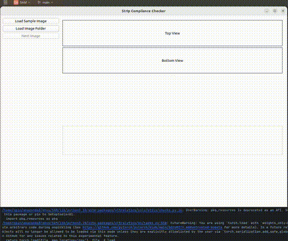

# PillStrip Inspector 🔍💊

### Automated Visual Inspection of Medicine Strips for Consistency Across Meals

---

## 📌 Project Overview

In long-term treatments, patients are often prescribed a complex set of medicines to be taken with different meals (morning, afternoon, night). Manually checking each strip for missing or extra pills can be tedious and error-prone. This project **automatically verifies** that the medicine strips for each meal contain the correct set of pills — **no pills should be missing or extra**.

The system uses object detection and segmentation to identify individual pills on the medicine strip. It then compares pills from a reference (sample) image to target images to detect any mismatch using shape comparisons.

---

## 🎯 Features

- Load a **sample/reference medicine strip image**.
- Load a **folder of medicine strip images** for batch processing.
- Automatically **detects pills** and **refines masks**.
- **Compares masks** based on shape and similarity.
- Highlights:
  - ✅ Matched pills
  - ❌ Missing pills
  - ⚠️ Extra pills
- Visual output with side-by-side comparison.
- Logs results per image with detailed analysis.

---

<!-- ## 🧠 Methodology

### 1. **Preprocessing**
- Crop and resize input images to focus on the area containing pills.
- Convert to RGB for model compatibility.

### 2. **Object Detection**
- Use **YOLOv8** (`last.pt`) to detect approximate pill locations.

### 3. **Segmentation**
- Use **SAM (Segment Anything)** to generate precise pill masks using detected centers from YOLO boxes.

### 4. **Refinement & Filtering**
- Masks are filtered using IoU to eliminate duplicates.
  
### 5. **Comparison Strategy**
- Each sample mask is compared with target image masks using:
  - **Shape Matching** (`cv2.matchShapes`)
  - **Color Similarity** (mean color difference in BGR space)
- Thresholds:
  - Shape similarity: `threshold < 0.15`
  - Color difference: `threshold < 65`

### 6. **Reporting**
- Visual and text-based feedback:
  - Green contours: matched pills
  - Red contours: extra pills
  - Sample image contours: yellow
- Log reports missing, extra, or successful matching. -->

## 🖼 GUI Workflow

